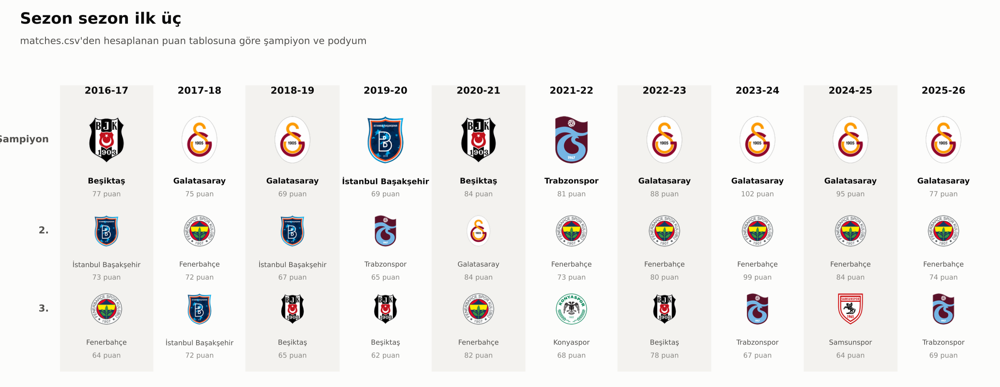
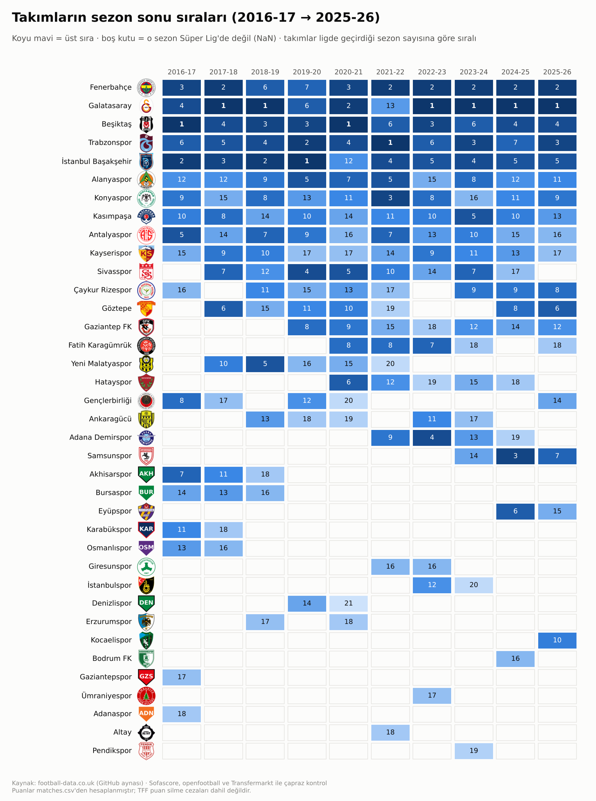
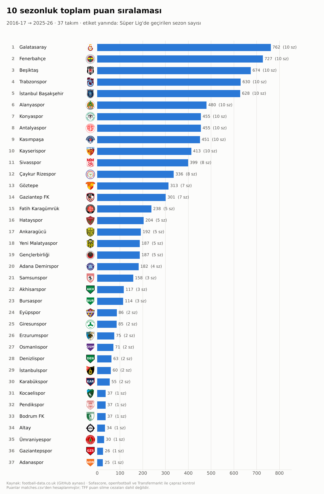
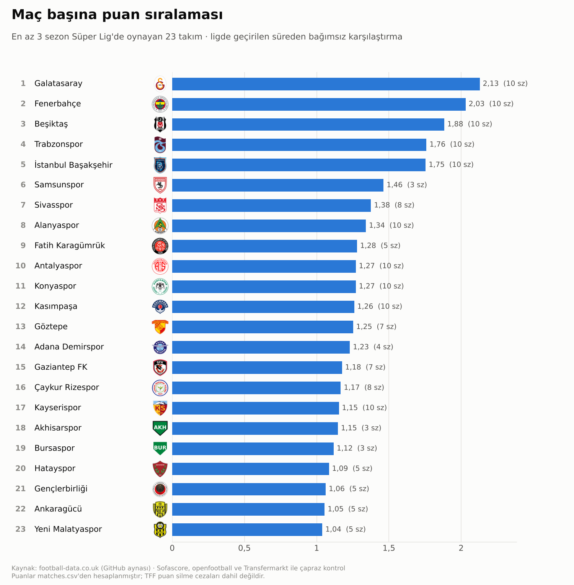

# Süper Lig takım analizi (2016-17 → 2025-26)

On sezonluk Süper Lig maç verisini birden fazla kaynaktan çeken, takım adlarını standartlaştıran,
kaynakları birbirine karşı doğrulayan, puan tablolarını maç sonuçlarından hesaplayan ve
takımları amblemleriyle sıralayan görseller üreten veri hattı.

```bash
pip install -r requirements.txt
python run_pipeline.py          # veri + rapor + görseller + pano
python run_pipeline.py --no-viz # yalnızca veri ve rapor
```

## Çıktılar

| Dosya | İçerik |
|---|---|
| `data/matches.csv` | sezon, tarih, ev, deplasman, ev_gol, dep_gol, kaynak + doğrulayan kaynaklar, çelişki ve hükmen işaretleri |
| `data/team_season.csv` | takım × sezon paneli: oynanan, galibiyet, beraberlik, mağlubiyet, atılan/yenilen gol, averaj, puan, sıra, iç/dış saha puanı. Takım o sezon ligde değilse değerler boş (NaN) |
| `data/attendance.csv` | takım × sezon: ort_seyirci, kapasite, kaynak (aşağıdaki nota bakın) |
| `data/team_mapping.csv` | her kaynaktaki ad yazımı → standart ad, kısa kod |
| `data/celiskiler.csv` | kaynakların farklı değer verdiği maçlar; her kaynağın değeri ve seçim kuralı |
| `data/eksik_veri_raporu.csv` | takım/sezon/alan bazında eksik veri listesi |
| `data/kaynak_kapsami.csv` | sezon × kaynak maç sayıları |
| `data/raw/football-data/` | football-data.co.uk T1 sezon dilimleri (yeniden üretilebilirlik için) |
| `reports/eksik_veri_raporu.md` | kaynak erişimi, kapsam, çelişkiler ve takım/sezon eksik veri ızgarası |
| `reports/pano.html` | sezon ve ölçüt seçilebilen etkileşimli sıralama panosu (tarayıcıda açın) |
| `reports/figures/*.png` | amblemli sıralama görselleri |
| `logs/pipeline.log`, `logs/kaynak_istekleri.csv` | her isteğin sonucu (ok / cache / hata / atlandı) |

## Kaynaklar ve sıra

1. **football-data.co.uk** Turkey `T1` sezon dosyaları (`mmz4281/{1617..2526}/T1.csv`). Erişilemeyen
   sezonlar, aynı dosyaları birleştiren GitHub aynasından (`xgabora/Club-Football-Match-Data-2000-2025`) alınır.
2. **Sofascore** (`datafc`, unique-tournament id 52; sezon id'leri `seasons_data` ile bulunur). Maç
   sonuçları eksik/hatalı sezonları tamamlamak ve çapraz kontrol için; seyirci (`event.attendance`) ve stadyum
   kapasitesi (`event.venue`) için. API erişilemezse maç sonuçları Sofascore event id'li GitHub aynasından
   (`c0ze/super-lig`, `data/site.db`) alınır.
3. **Wikipedia** sezon sayfaları: seyirci/kapasite yedeği.
4. Ek bağımsız çapraz kontrol: `openfootball/europe` (6 sezon) ve Transfermarkt maç raporları
   (`c0ze/super-lig`, `data/super_lig.db`).

Tüm GitHub kaynakları sabit bir commit'e (SHA) iliştirilmiştir (`superlig/config.py`).

**Kurallar:** host başına istekler arası bekleme, tüm yanıtlar `cache/http/` altında önbellekte,
hatalar loglanır ve hat devam eder; bir host art arda 3 kez bağlantı hatası verirse kalan istekleri
denenmez. Çelişkide çoğunluk oyu kullanılır, eşitlikte öncelik
football-data > sofascore > openfootball > transfermarkt; tüm değerler `celiskiler.csv`'de kalır.

### Bu sürümün durumu

Bu veri seti, `www.football-data.co.uk`, `api.sofascore.com` ve `en.wikipedia.org`'a ağ politikası
nedeniyle bağlanılamayan bir ortamda üretildi. Bu nedenle:

- Maç sonuçları GitHub aynalarından geldi ve **3.394 maçın hepsi en az iki kaynakla** doğrulandı
  (1.821 maç dört, 1.503 maç üç kaynakla). Yalnızca 3 maçta skor çelişkisi var.
- **Seyirci ve stadyum kapasitesi boş.** Erişilebilen hiçbir aynada bu alanlar yok ve veri uydurulmadı.
  Bu hostlara erişim açıldığında `python run_pipeline.py` yeniden çalıştırılınca resmi kaynaklar
  kullanılır, `attendance.csv` dolar ve seyirci sıralamaları panoda ve görsellerde kendiliğinden belirir.

## Görseller

Amblemler `luukhopman/football-logos` deposundan. 2021 öncesi ligden düşen yedi kulübün (Adanaspor,
Akhisarspor, Bursaspor, Denizlispor, Gaziantepspor, Karabükspor, Osmanlıspor) amblemi bu depoda yok; bunlar
için kulüp renklerinde, kısa kodlu bir yer tutucu rozet üretildi (`assets/logos/KAYNAK.csv`).

| | |
|---|---|
|  |  |
|  |  |

Ayrıca: her sezon için amblemli puan durumu (`puan_durumu_<sezon>.png`), toplam galibiyet, toplam atılan gol,
maç başına gol ve iç sahada maç başına puan sıralamaları.

## Yöntem notları

- Puan ve sıra yalnızca `matches.csv` skorlarından hesaplanır. Sıralama: puan → ikili maçlarda puan →
  ikili averaj → ikili atılan gol → genel averaj → atılan gol. TFF puan silme cezaları maç verisinde
  olmadığı için uygulanmaz; bazı sezonlarda resmi tablodan bu nedenle sapma olabilir.
- Sezon ataması tarihe göre yapılır (15 Temmuz kesim; COVID'li 2020'de 15 Ağustos).
- 2022-23'te deprem sonrası çekilen Gaziantep FK ve Hatayspor'un kalan 29 maçı hükmen 3-0 olarak dahildir.
